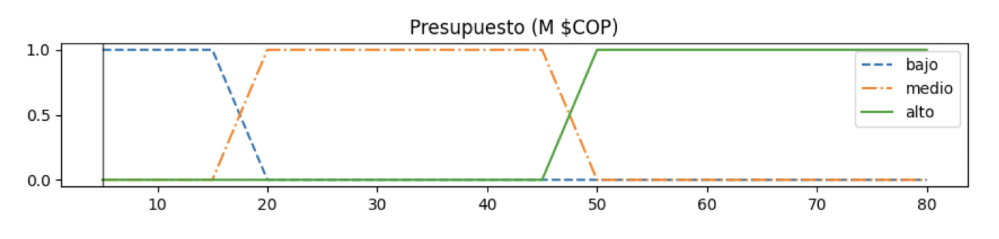
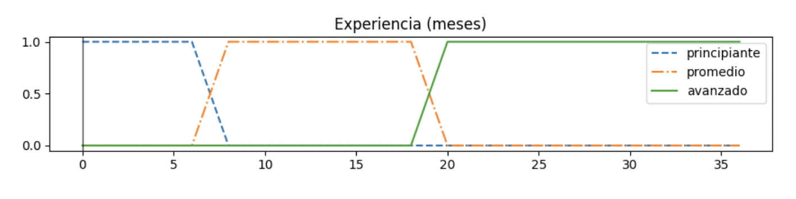
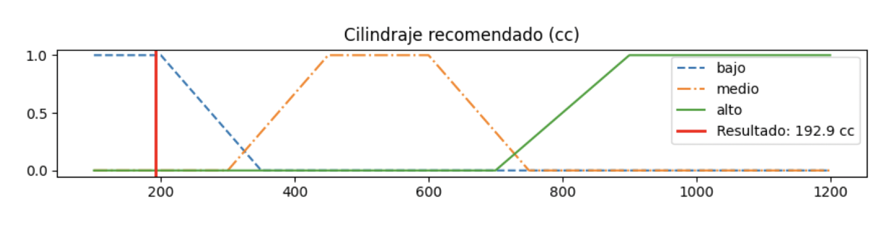
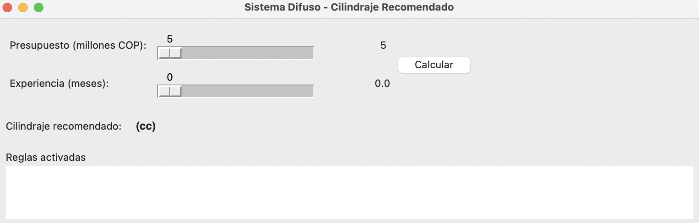
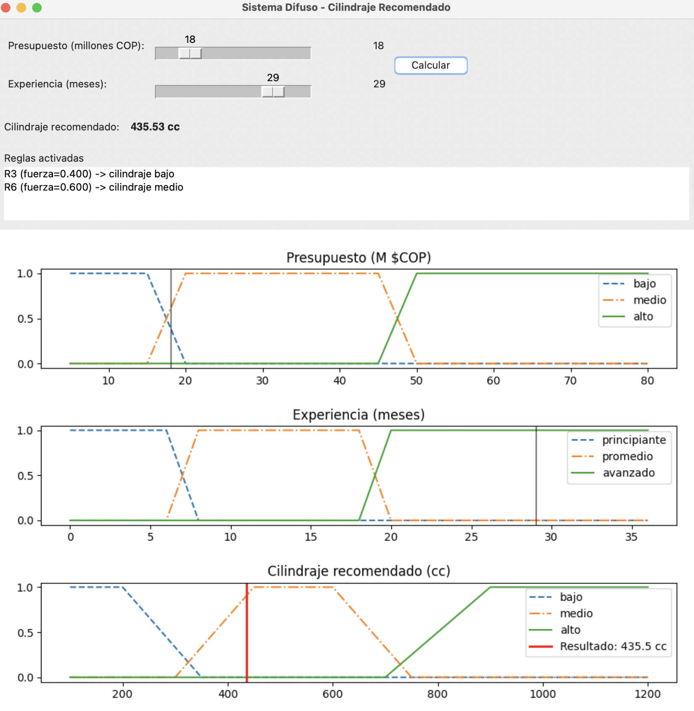

# Sistema Difuso para el Cálculo de Cilindrada Recomendada (Motocicletas)

**Autores:**  
- Jose Félix Herrera Piedrahita – jose_herrera23171@elpoli.edu.co  
- Juan Pablo Mesa Arroyave – juanp_mesa23171@elpoli.edu.co  

**Institución:**  
Politécnico Colombiano Jaime Isaza Cadavid – Medellín, Colombia.  

---

## 1. Descripción general

La temática del ejercicio se centra en la recomendación del cilindraje de una motocicleta a partir de dos variables principales: el presupuesto disponible del usuario y su nivel de experiencia en conducción. El objetivo es implementar un sistema de lógica difusa que permita manejar la incertidumbre inherente a este tipo de decisiones, pues en la práctica no siempre es sencillo establecer límites exactos para definir si un presupuesto es bajo, medio o alto, o si la experiencia de un conductor es principiante, promedio o avanzada. De esta manera, el sistema ofrece una recomendación adaptativa que se ajusta a diferentes combinaciones de entradas, proporcionando un resultado más flexible y realista (Ross, 2010).

Las entradas del sistema son, por un lado, el **presupuesto**, expresado en millones de pesos colombianos, y por otro, la **experiencia** medida en meses de conducción. La salida corresponde al **cilindraje recomendado**, expresado en centímetros cúbicos (cc). A nivel de reglas, se definieron nueve combinaciones posibles que relacionan cada nivel de presupuesto con cada nivel de experiencia, estableciendo así un mapa de decisión completo. Por ejemplo, un usuario con bajo presupuesto, sin importar su experiencia, recibe la recomendación de un cilindraje bajo, mientras que alguien con alto presupuesto y experiencia avanzada obtiene la recomendación de un cilindraje alto. Este esquema de reglas garantiza que el sistema siempre brinde una respuesta coherente y ajustada al contexto del usuario.  

---

## 2. Conjuntos difusos definidos

En la siguiente figura se presenta el conjunto de entrada **Presupuesto**, compuesto por 3 etiquetas: Bajo, Medio y Alto.  

  
*Figura 1. Conjunto difuso de entrada Presupuesto*  

En la siguiente figura se presenta el conjunto de entrada **Experiencia**, compuesto por 3 etiquetas: Principiante, Promedio y Avanzado.  

  
*Figura 2. Conjunto difuso de entrada Experiencia*  

En la siguiente figura se presenta el conjunto de salida **Cilindraje**, con 3 etiquetas: Bajo, Medio y Alto.  

  
*Figura 3. Conjunto difuso de salida Cilindraje*  

---

## 3. Reglas difusas

En esta sección se presentan las reglas del sistema difuso:  

1. Si presupuesto **bajo** y experiencia **principiante**, entonces cilindraje **bajo**.  
2. Si presupuesto **bajo** y experiencia **promedio**, entonces cilindraje **bajo**.  
3. Si presupuesto **bajo** y experiencia **avanzado**, entonces cilindraje **bajo**.  
4. Si presupuesto **medio** y experiencia **principiante**, entonces cilindraje **bajo**.  
5. Si presupuesto **medio** y experiencia **promedio**, entonces cilindraje **medio**.  
6. Si presupuesto **medio** y experiencia **avanzado**, entonces cilindraje **medio**.  
7. Si presupuesto **alto** y experiencia **principiante**, entonces cilindraje **medio**.  
8. Si presupuesto **alto** y experiencia **promedio**, entonces cilindraje **alto**.  
9. Si presupuesto **alto** y experiencia **avanzado**, entonces cilindraje **alto**.  

---

## 4. Aplicación construida

La aplicación fue desarrollada en **Python** usando la librería **Tkinter** para la interfaz gráfica y **scikit-fuzzy** para la parte difusa, implementada en el IDE Visual Studio Code.  

En la siguiente figura se muestra el formulario principal de la aplicación:  

  
*Figura 4. Pantallazo del sistema de inserción de datos*  

En la siguiente figura se presenta el resultado final del sistema, luego de ingresar los valores de entrada:  

  
*Figura 5. Pantallazo de resultado final del sistema*  

El código de la aplicación construida puede ser accedido en el siguiente repositorio de GitHub:  
👉 [URL del repositorio]  

La aplicación en funcionamiento puede verse en el siguiente video:  
👉 [URL del video en YouTube]  

---

## 5. Conclusiones

El desarrollo de este sistema permitió evidenciar las ventajas de los modelos basados en lógica difusa para problemas en los que la toma de decisiones no se puede limitar a límites rígidos o exactos. A diferencia de un enfoque tradicional, donde únicamente se obtendrían respuestas fijas, la lógica difusa posibilita manejar términos como “bajo”, “medio” o “alto” y traduce esa imprecisión en recomendaciones más realistas. Esto representa una fortaleza significativa en el caso de la elección de una motocicleta, pues la decisión depende de variables subjetivas como la percepción del presupuesto o el nivel de experiencia, que difícilmente se pueden acotar de forma estricta.  

Como trabajo futuro, este sistema podría enriquecerse con nuevas entradas y reglas que permitan considerar más factores relevantes para la recomendación. Por ejemplo, incluir la finalidad de uso de la motocicleta (trabajo, recreación, viajes largos), la edad del conductor, o incluso aspectos relacionados con la seguridad vial. También se podría mejorar la interfaz gráfica para ofrecer una experiencia más interactiva, o integrar bases de datos con modelos de motocicletas reales que correspondan al cilindraje recomendado. De esta manera, la aplicación evolucionaría hacia una herramienta más completa y cercana a un sistema experto en asesoría de compra de motocicletas.  

---

## 6. Bibliografía  

Ross, T. J. (2010). *Fuzzy Logic with Engineering Applications* (3rd ed.). John Wiley & Sons.  
